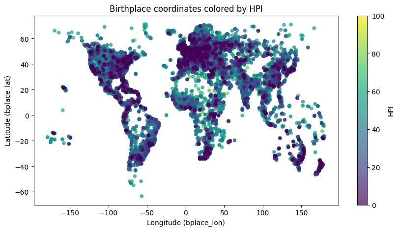
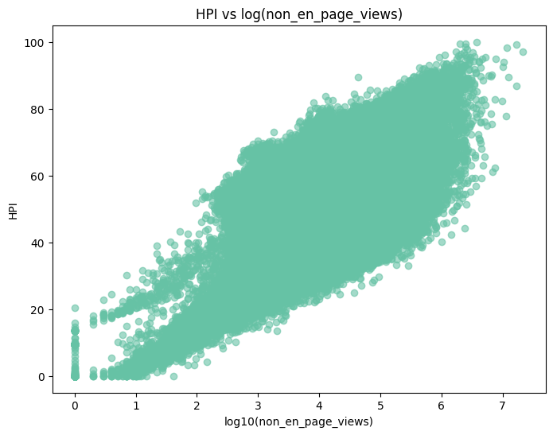

# Визуализация данных: датасет Pantheon

Разведочный анализ и визуализация датасета [Pantheon](https://pantheon.world/data/datasets) — 127 тыс. известных личностей с годом и местом рождения, родом занятий, полом, просмотрами страниц Википедии и индексом исторической известности (HPI). Один набор из 10 графиков реализован тремя инструментами — Matplotlib/Seaborn, Altair и Plotly; отдельно разобрано приведение данных к tidy-формату и собраны интерактивные дашборды с кросс-фильтрацией.

<p align="center">
  
  
</p>

## Ноутбуки

| # | Ноутбук | Что сделано | Интерактив |
|---|---------|-------------|:---:|
| 1 | [`01_eda_matplotlib_seaborn.ipynb`](01_eda_matplotlib_seaborn.ipynb) | Подготовка данных (приведение типов, разбор дат, производные признаки) и 10 статичных графиков: распределения, KDE, корреляции, карта мест рождения | — |
| 2 | [`02_tidy_data_pandas.ipynb`](02_tidy_data_pandas.ipynb) | Tidy data: три типичные «грязные» формы таблиц и их восстановление средствами pandas с автоматической проверкой | — |
| 3 | [`03_altair_interactive.ipynb`](03_altair_interactive.ipynb) | Те же графики на Altair: декларативные кодировки, всплывающие подсказки, композиция графиков, карта в проекции Natural Earth | [](https://colab.research.google.com/github/eusevios/pantheon-dataviz/blob/main/03_altair_interactive.ipynb) |
| 4 | [`04_altair_dashboards.ipynb`](05_plotly_interactive.ipynb) | Два дашборда с кросс-фильтрацией | [](https://colab.research.google.com/github/eusevios/pantheon-dataviz/blob/main/04_altair_dashboards.ipynb) |
| 5 | [`05_plotly_interactive.ipynb`](05_plotly_interactive.ipynb) | Plotly Express и Graph Objects: переключатели, анимация по десятилетиям, marginal-графики, гео-карта | [](https://colab.research.google.com/github/eusevios/pantheon-dataviz/blob/main/05_plotly_interactive.ipynb) |

> GitHub не выполняет JavaScript в ноутбуках, поэтому интерактивные графики из ноутбуков 3–5 здесь не отображаются. Смотрите их в Colab (кнопки в таблице) или через [nbviewer](https://nbviewer.org/github/eusevios/pantheon-dataviz/tree/main/).

## Дашборды

**Страны и профессии.** Клик по стране в рейтинге топ-15 перестраивает топ-10 профессий этой страны и фильтрует диаграмму рассеяния «год рождения × HPI». Агрегация и ранжирование оконной функцией `rank()` выполняются прямо в спецификации графика, без пересчёта в pandas.

**Временная шкала и пол.** Выделение диапазона лет «кистью» на таймлайне рождений пересчитывает распределение по полу и подсвечивает соответствующие точки на графике «популярность × HPI».

Дашборды построены на случайной выборке из 4 тыс. записей: Altair встраивает данные прямо в ноутбук, поэтому объём приходится ограничивать.

<!--
Сюда стоит добавить запись экрана дашборда из ноутбука 4 и раскомментировать строку:

-->

## Tidy data

Для каждого из трёх антипаттернов таблица сначала намеренно «ломается», затем восстанавливается, а совпадение с исходной проверяется автоматически:

- **значения в названиях столбцов** — ломается через `pivot`, восстанавливается через `melt`;
- **несколько значений в одной ячейке** — склейка через `|`, восстановление через `str.split(expand=True)` с приведением типов;
- **переменные одновременно в строках и столбцах** — `melt` + `pivot`, восстановление через `stack` + `pivot`.

В конце — сводная таблица через `groupby` + `unstack` с «уплощением» мультииндекса столбцов.

## Что видно в данных

- Связь HPI с популярностью сильно нелинейная: коэффициент Пирсона с сырыми просмотрами всего 0.25 из-за тяжёлого хвоста, а на логарифмической шкале видна устойчивая возрастающая зависимость. Поэтому просмотры везде показаны в log-шкале.
- HPI отрицательно коррелирует с годом рождения (−0.34): у исторических фигур индекс в среднем выше, чем у современников.
- Январь заметно выделяется по числу рождений (≈11 тыс. против 8.5–9.7 тыс. в остальные месяцы). Похоже на артефакт данных, например 1 января при неизвестной точной дате; прежде чем делать выводы о сезонности, это нужно проверить.

## Данные

Датасет `person_2025_update.csv.bz2` (126 582 записи, 34 признака) скачивается со страницы [Pantheon Datasets](https://pantheon.world/data/datasets) и в репозиторий не включён. Положите файл рядом с ноутбуками; в Colab загрузите его через панель «Файлы».

## Запуск

```bash
git clone https://github.com/eusevios/pantheon-dataviz.git
cd pantheon-dataviz
pip install pandas numpy matplotlib seaborn altair plotly jupyter
jupyter notebook
```

Ноутбуки 3 и 4 настроены на Colab (`alt.renderers.enable('colab')`); для локального Jupyter эту строку нужно убрать.

## Стек

Python · pandas · NumPy · Matplotlib · Seaborn · Altair · Plotly
